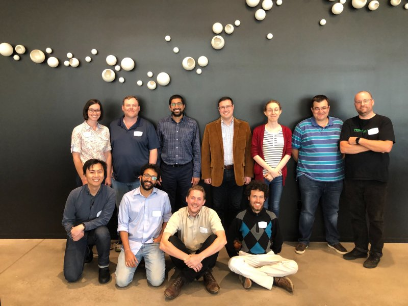

Rooms:
  - Workshop: RV 2201
  - Quiet Room: RV 2501
  - Lunch: GCC Rooftop (take elevator 1)

SERPL Programme on May 11, 2019:

- 8:30 - 9:15 : Registration and Snacks
- 9:15 - 9:25 : Opening Remarks from the Dean of the School of Computer and Cyber Sciences, Alex Schwarzmann
- 9:30 - 10:30 : (Keynote) "Metaprogramming Haskell, The Racket Way", [Alexis King](https://lexi-lambda.github.io/resume.html)  
    [Abstract](includes/abstracts/Alexis-King.html), [Slides](includes/slides/Alexis-King.pdf), [Picture](images/Alexis-King.jpg)

- 10:35 - 11:05 : "On Optimally Combining Static and Dynamic Analyses For Intensional Program Properties", [Ravi Mangal](https://www.cc.gatech.edu/~rmangal3/) (Georgia Tech)  
    [Abstract](includes/abstracts/Ravi-Mangal.pdf), [Slides](includes/slides/Ravi-Mangal.pdf), [Picture](images/Ravi-Mangal.jpg)
    
- 11:10 - 11:40 : "Semantic-Aware Synchronization Determinism and Beyond", Qi Zhao (North Carolina State University)  
    [Abstract](includes/abstracts/Qi-Zhao.pdf), [Slides](includes/slides/Qi-Zhao.pdf) ([in pptx](includes/slides/Qi-Zhao.pptx)), [Picture](images/Qi-Zhao.jpg)

- 11:45 - 12:20 : "Structural Equivalence in Reversible Calculus of Communicating Systems", [Clément Aubert](http://spots.augusta.edu/caubert/) (Augusta University)  
    [Abstract](includes/abstracts/Clement-Aubert.pdf), [Slides](includes/slides/Clement-Aubert.pdf)

- 12:30 - 13:25 : Lunch on the rooftop of the GCC
- 13:30 - 14:00 : "Escaping the Clone Zone: Java Runtime-Managed Snapshots Current and Future Work", Matt Davis (East Carolina University)  
    [Abstract](includes/abstracts/Matt-Davis.pdf), [Slides](includes/slides/Matt-Davis.pdf) ([in pptx](includes/slides/Matt-Davis.pptx)), [Picture](images/Matt-Davis.jpg)

- 14:05 - 14:35 : "On the Internal and External View of Graded Linear Logic", Preston Keel (Augusta University)  
    [Abstract](includes/abstracts/Preston-Keel.pdf), [Slides](includes/slides/Preston-Keel.pdf) ([in key](includes/slides/Preston-Keel.key)), [Picture](images/Preston-Keel.jpg)

- 14:40 - 15:10 : "The Granule Project", [Harley Eades](https://metatheorem.org/)  (Augusta University)  
    [Abstract](includes/abstracts/Harley-Eades.pdf), [Slides](includes/slides/Harley-Eades.pdf)

- 15:10 - 15:40 : Break
- 15:40 - 16:10 : "Language-Level Support for Co-Creative Programming", [Chris Martens](https://sites.google.com/ncsu.edu/cmartens) (North Carolina State University)  
    [Abstract](includes/abstracts/Chris-Martens.pdf), [Slides](includes/slides/Chris-Martens.pdf), [Picture](images/Chris-Martens.jpg)

- 16:15 - 16:45 : "Understanding Database Usage in PHP Systems: Current and Future Work", [Mark Hills](http://www.cs.ecu.edu/hillsma/) (East Carolina University)  
    [Abstract](includes/abstracts/Mark-Hills.pdf), [Slides](includes/slides/Mark-Hills.pdf), [Picture](images/Mark-Hills.jpg)

- 16:45 - ???? : Gather a group for dinner

 <table>
  <tr>
    <th>From left to right:</th>
    <th></th>
  </tr>
  <tr>
    <td></td>
    <td>Aubrey Bryant, Mark Hills, Shivan Bhatt, Matt Davis, Alexis King, Aleksei Vilkomir, Harley Eades,</td>
    </tr>
    <tr>
    <td></td>
    <td>Qi Zhao, Ravi Mangal, Clément Aubert, James O'meara</td>
  </tr>
</table> 

